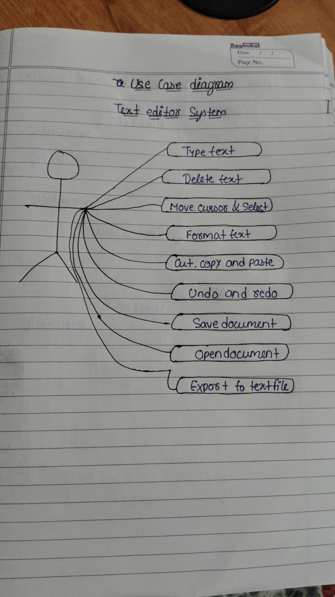
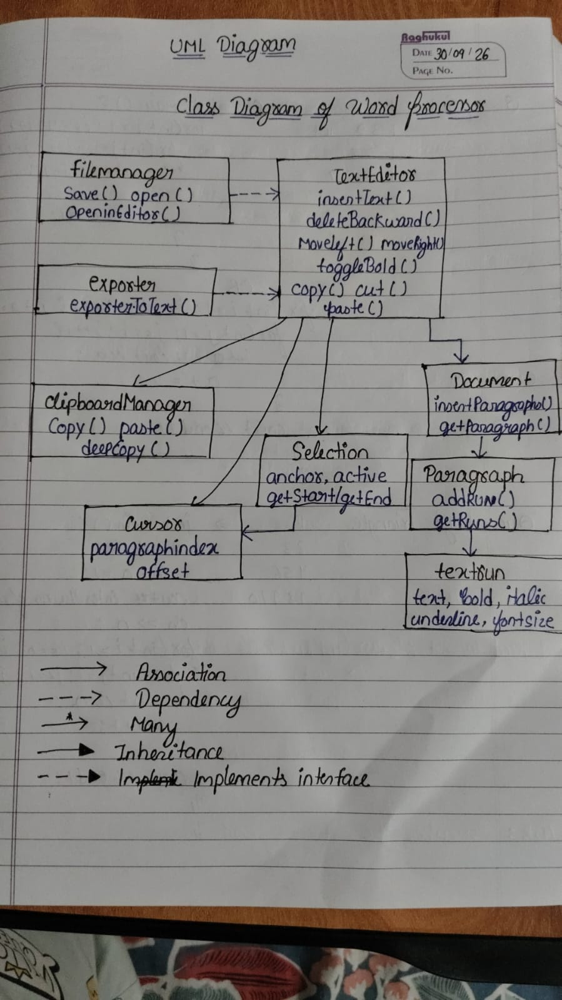
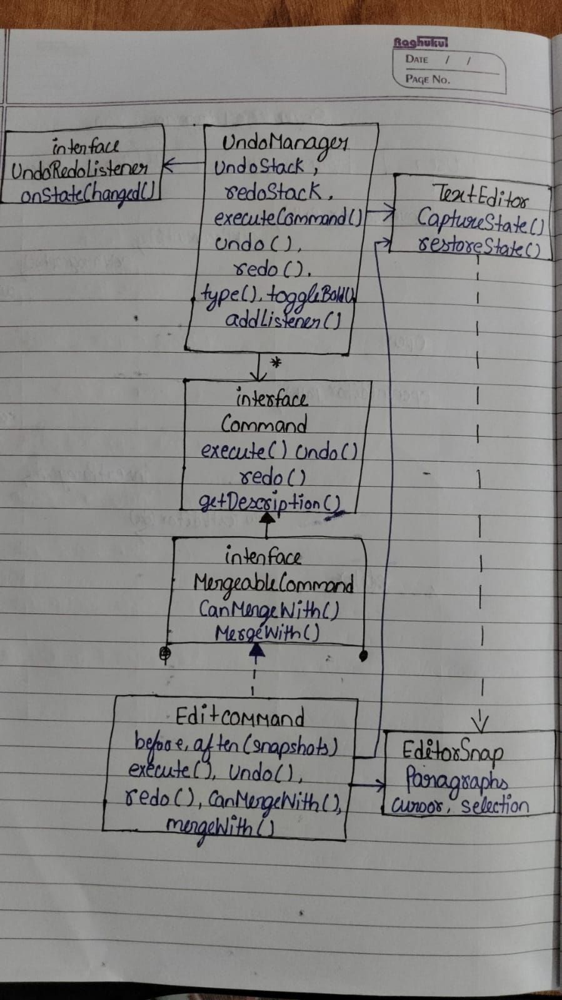
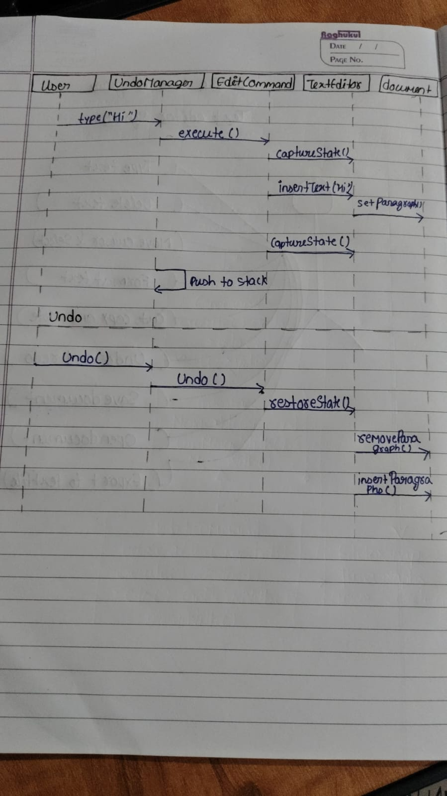
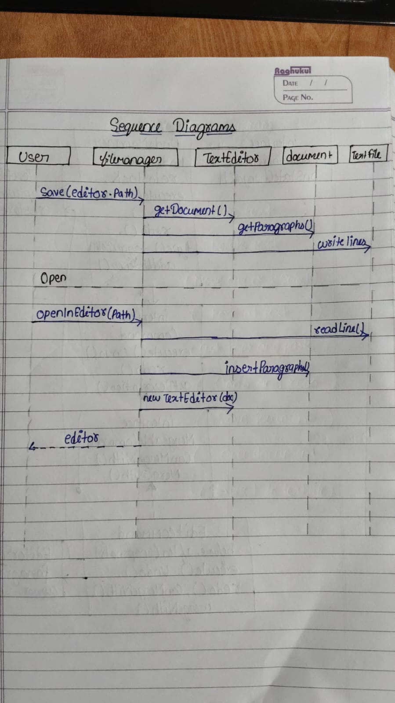

# Documentation

Design documents for the Text Editor / Word Processor project. All diagrams are hand-drawn and scanned from my notebook (dated 30/09/26).

## Contents

1. [Use Case Diagram](#1-use-case-diagram)
2. [Class Diagram - Word Processor](#2-class-diagram---word-processor)
3. [Class Diagram - Undo/Redo](#3-class-diagram---undoredo)
4. [Sequence Diagram - Undo](#4-sequence-diagram---undo)
5. [Sequence Diagram - Save and Open](#5-sequence-diagram---save-and-open)

---

## 1. Use Case Diagram



Shows what the user (the only actor) can do with the text editor system:

- Type text
- Delete text
- Move cursor and select
- Format text
- Cut, copy and paste
- Undo and redo
- Save document
- Open document
- Export to text file

## 2. Class Diagram - Word Processor



Main structure of the word processor.

- **TextEditor** is the central class: insertText(), deleteBackward(), moveLeft(), moveRight(), toggleBold(), copy(), cut(), paste()
- **FileManager** (save, open, openInEditor) and **Exporter** (exportToText) depend on TextEditor
- **TextEditor** is associated with ClipboardManager, Selection, Cursor and Document
- **ClipboardManager**: copy(), paste(), deepCopy()
- **Selection**: anchor, active, getStart()/getEnd()
- **Cursor**: paragraphIndex, offset
- **Document** has many Paragraphs (insertParagraph(), getParagraph())
- **Paragraph** has many TextRuns (addRun(), getRuns())
- **TextRun**: text, bold, italic, underline, fontSize

Legend used in the diagram: association, dependency, many (*), inheritance, implements interface.

## 3. Class Diagram - Undo/Redo



Undo/redo is built with the Command pattern plus snapshots.

- **UndoManager**: undoStack, redoStack, executeCommand(), undo(), redo(), type(), toggleBold(), addListener()
- **UndoRedoListener** (interface): onStateChanged(), so the UI gets notified when undo/redo state changes
- **Command** (interface): execute(), undo(), redo(), getDescription(). UndoManager holds many commands
- **MergeableCommand** (interface): canMergeWith(), mergeWith(), used to merge small edits (like typing letters) into one undo step
- **EditCommand** implements MergeableCommand. It stores before/after snapshots
- **TextEditor**: captureState(), restoreState()
- **EditorSnapshot**: paragraphs, cursor, selection

## 4. Sequence Diagram - Undo



Objects: User, UndoManager, EditCommand, TextEditor, Document.

Typing:
1. User calls type("Hi") on UndoManager
2. UndoManager calls execute() on EditCommand
3. EditCommand calls captureState() on TextEditor (before snapshot)
4. EditCommand calls insertText("Hi"), which calls setParagraph() on Document
5. EditCommand calls captureState() again (after snapshot)
6. UndoManager pushes the command to the stack

Undo:
1. User calls undo() on UndoManager
2. UndoManager calls undo() on EditCommand
3. EditCommand calls restoreState() on TextEditor
4. TextEditor calls removeParagraph() and insertParagraph() on Document

## 5. Sequence Diagram - Save and Open



Objects: User, FileManager, TextEditor, Document, TextFile.

Save:
1. User calls save(editor, path) on FileManager
2. FileManager calls getDocument() on TextEditor
3. FileManager calls getParagraphs() on Document
4. FileManager writes the lines to the TextFile

Open:
1. User calls openInEditor(path) on FileManager
2. FileManager calls readLine() on TextFile
3. FileManager calls insertParagraph() on Document for each line
4. FileManager creates new TextEditor(doc)
5. The editor is returned to the User

## Folder structure

```
documentation/
  README.md
  images/
    01-use-case-diagram.jpeg
    02-class-diagram-word-processor.jpeg
    03-class-diagram-undo-redo.jpeg
    04-sequence-diagram-undo.jpeg
    05-sequence-diagram-save-open.jpeg
```
